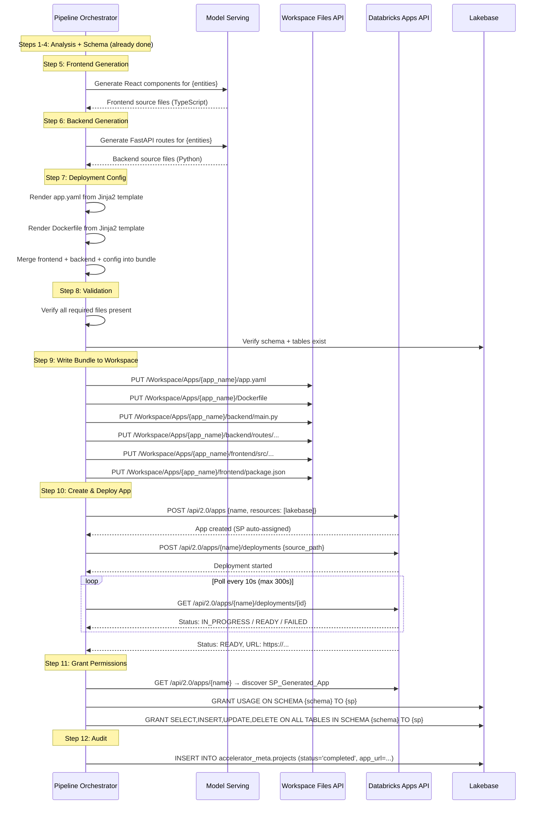

# Lakebase Accelerator — Agent Architecture & Deployment Strategy

## Overview

The accelerator backend uses a **pipeline orchestrator pattern** — not a free-form autonomous agent. The LLM (via Databricks Model Serving) provides reasoning at specific steps, but the execution flow is deterministic and sequential. Each step is a Python service function that may or may not call the LLM depending on the task.

The agent's job is to:
1. Analyze the user's input (prompt or prototype)
2. Design a data model
3. Provision infrastructure (Lakebase schema)
4. Generate a full-stack application (React frontend + FastAPI backend)
5. Bundle everything into a deployable package
6. Deploy it as a Databricks App in the client's workspace
7. Configure permissions so the generated app can only access its own data

---

## Agent Execution Model

### Not a Free-Form Agent

This is **not** a ReAct/tool-calling loop where the LLM decides what to do next. Instead:

```
User Input → Fixed Pipeline (12 steps) → Deployed App
```

The LLM is called at specific steps for reasoning/generation, but the orchestrator controls the flow. This gives us:
- Predictable execution time (≤5 minutes)
- Deterministic step ordering
- Clear error attribution per step
- No infinite loops or runaway token consumption

### Where the LLM is Used vs Not Used

| Step | LLM Used? | Purpose |
|------|-----------|---------|
| 1. Requirement Intake / Prototype Ingestion | ✅ Yes | Analyze prompt, extract entities |
| 2. Data Model Inference | ✅ Yes | Design PostgreSQL schema from entities |
| 3. Schema Provisioning | ❌ No | Execute DDL (deterministic) |
| 4. Seed Data Generation | ✅ Yes | Generate realistic domain data |
| 5. Frontend Generation | ✅ Yes | Generate React code |
| 6. Backend Generation | ✅ Yes | Generate FastAPI code |
| 7. Deployment Config | ❌ No | Template-based (Jinja2) |
| 8. Validation | ❌ No | Programmatic checks |
| 9. Workspace Write | ❌ No | API calls (deterministic) |
| 10. App Deployment | ❌ No | API calls (deterministic) |
| 11. Permission Grant | ❌ No | SQL GRANT statements |
| 12. Audit | ❌ No | Database insert |

---

## Generated App Bundle Structure

When the agent generates an application, it produces a **complete deployable bundle** — both frontend and backend in a single package. This bundle is what gets deployed as a Databricks App.

### Bundle File Layout

```
/Workspace/Apps/{app_name}/
├── app.yaml                    # Databricks App manifest
├── Dockerfile                  # Multi-stage build (Node + Python)
├── .env.sample                 # Environment variable documentation
│
├── backend/                    # Generated FastAPI backend
│   ├── main.py                 # FastAPI app entry point (serves API + static SPA)
│   ├── requirements.txt        # Python dependencies (pinned)
│   ├── database.py             # psycopg2 connection pool + helpers
│   ├── models.py               # Pydantic request/response models
│   └── routes/                 # Per-entity route modules
│       ├── __init__.py
│       ├── {entity_1}.py       # CRUD endpoints for entity 1
│       ├── {entity_2}.py       # CRUD endpoints for entity 2
│       └── ...
│
├── frontend/                   # Generated React frontend (source)
│   ├── package.json
│   ├── vite.config.ts
│   ├── tsconfig.json
│   ├── index.html
│   └── src/
│       ├── main.tsx
│       ├── App.tsx             # React Router setup
│       ├── api/
│       │   └── client.ts       # Axios API client
│       ├── types/
│       │   └── index.ts        # TypeScript interfaces per entity
│       ├── pages/
│       │   ├── {Entity1}List.tsx
│       │   ├── {Entity1}Detail.tsx
│       │   ├── {Entity1}Form.tsx
│       │   └── ...
│       └── components/
│           ├── Layout.tsx
│           ├── Navigation.tsx
│           └── ...
│
└── frontend/dist/              # Built React SPA (after Docker build)
    ├── index.html
    └── assets/
        ├── index-{hash}.js
        └── index-{hash}.css
```

### How Frontend + Backend Are Bundled

The generated app uses a **single-container deployment** where:
1. The **Dockerfile** builds the React frontend (Node stage) and packages it with the FastAPI backend (Python stage).
2. The **FastAPI backend** serves the built React SPA as static files at `/` and API routes at `/api/v1/*`.
3. This means one container, one port, one URL — no separate frontend deployment needed.

```dockerfile
# ─── Stage 1: Build React Frontend ───────────────────────────────
FROM node:20-alpine AS frontend-build
WORKDIR /app/frontend
COPY frontend/package.json frontend/package-lock.json ./
RUN npm ci
COPY frontend/ ./
RUN npm run build

# ─── Stage 2: Python Runtime ─────────────────────────────────────
FROM python:3.11-slim
WORKDIR /app

# Install Python dependencies
COPY backend/requirements.txt ./
RUN pip install --no-cache-dir -r requirements.txt

# Copy backend code
COPY backend/ ./

# Copy built frontend from Stage 1
COPY --from=frontend-build /app/frontend/dist ./static/

# Expose port and start
EXPOSE 8000
CMD ["uvicorn", "main:app", "--host", "0.0.0.0", "--port", "8000"]
```

### Generated Backend Entry Point (main.py)

The generated `main.py` serves both the API and the SPA:

```python
from fastapi import FastAPI
from fastapi.staticfiles import StaticFiles
from fastapi.responses import FileResponse

app = FastAPI(title="{AppName}")

# Register entity routes
from routes import entity1, entity2
app.include_router(entity1.router, prefix="/api/v1")
app.include_router(entity2.router, prefix="/api/v1")

# Serve React SPA static files
app.mount("/assets", StaticFiles(directory="static/assets"), name="assets")

# SPA fallback — all non-API routes serve index.html
@app.get("/{path:path}")
async def serve_spa(path: str):
    return FileResponse("static/index.html")
```

---

## Deployment Flow (How the Agent Deploys)

### Step-by-Step Deployment Sequence



### What Happens During Databricks App Deployment

When the agent calls `POST /api/2.0/apps/{name}/deployments`:

1. Databricks reads the source files from `/Workspace/Apps/{app_name}/`.
2. Databricks finds the `Dockerfile` and builds the container image.
3. During the Docker build:
   - Stage 1: `npm ci` + `npm run build` compiles the React frontend into `dist/`.
   - Stage 2: Python dependencies are installed, backend code is copied, built frontend is copied into `static/`.
4. Databricks deploys the container and assigns a URL.
5. The app starts with `uvicorn main:app` — serving both API and SPA on a single port.

### app.yaml Structure (Generated)

```yaml
command:
  - "uvicorn"
  - "main:app"
  - "--host"
  - "0.0.0.0"
  - "--port"
  - "8000"

resources:
  - name: "lakebase"
    type: "sql_warehouse"
    config:
      warehouse_id: "${LAKEBASE_WAREHOUSE_ID}"

env:
  - name: "LAKEBASE_SCHEMA"
    value: "${schema_name}"
  - name: "LAKEBASE_HOST"
    valueFrom: "resources.lakebase.host"
  - name: "LAKEBASE_PORT"
    valueFrom: "resources.lakebase.port"
  - name: "LAKEBASE_DATABASE"
    valueFrom: "resources.lakebase.database"
```

---

## Agent Tool Architecture (Internal)

### Tool = Service Function

Each "agent tool" is a Python service class following the layered architecture:

```
GreenFieldPipelineService (orchestrator)
  ├── RequirementIntakeService      → calls LLMClient
  ├── DataModelInferenceService     → calls LLMClient
  ├── SchemaProvisioningService     → calls LakebaseRepository
  ├── SeedDataService               → calls LLMClient + LakebaseRepository
  ├── FrontendGenerationService     → calls LLMClient
  ├── BackendGenerationService      → calls LLMClient
  ├── DeploymentConfigService       → uses Jinja2 templates (no LLM)
  ├── ValidationService             → calls LakebaseRepository (checks)
  ├── AppDeploymentService          → calls WorkspaceFilesRepo + DatabricksAppsRepo
  ├── PermissionService             → calls DatabricksAppsRepo + LakebaseRepository
  └── AuditService                  → calls LakebaseRepository
```

### LLM Interaction Pattern

Every LLM-powered step follows the same pattern:

```python
class RequirementIntakeService:
    def __init__(self, llm_client: LLMClient, prompt_loader: PromptLoader):
        self.llm_client = llm_client
        self.prompt_loader = prompt_loader

    async def execute(self, user_prompt: str) -> AnalysisResult:
        system_prompt = self.prompt_loader.load("requirement_intake")
        
        result = await self.llm_client.call(
            system_prompt=system_prompt,
            user_prompt=user_prompt,
            response_model=AnalysisResult,  # Pydantic validation
            temperature=0.1,
            max_tokens=4096,
        )
        
        # Post-validation (business rules)
        self._validate_analysis(result)
        return result
```

### LLM Client with Retry

```python
class LLMClient:
    """Calls Databricks Model Serving with retry + structured output."""
    
    async def call(self, system_prompt, user_prompt, response_model, ...):
        for attempt in range(self.max_retries + 1):
            try:
                response = await self._invoke_endpoint(system_prompt, user_prompt)
                parsed = response_model.model_validate_json(response)
                return parsed
            except ValidationError as e:
                # Append validation error to prompt for self-correction
                user_prompt += f"\n\nYour previous response failed validation: {e}"
            except (HTTPStatusError, TimeoutError) as e:
                if attempt == self.max_retries:
                    raise LLMClientError(f"Max retries exceeded: {e}")
                await asyncio.sleep(2 ** attempt)  # Exponential backoff
```

---

## Code Generation Strategy

### How the Agent Generates Code

The agent uses a **hybrid approach**: Jinja2 templates for boilerplate + LLM for entity-specific logic.

#### Template-Based (Deterministic)
- `app.yaml` — filled from project config
- `Dockerfile` — standard multi-stage build
- `requirements.txt` — fixed dependency set
- `package.json` — fixed dependency set
- `vite.config.ts` — standard Vite config
- `tsconfig.json` — standard TypeScript config
- `database.py` — connection pool setup (schema name injected)

#### LLM-Generated (Dynamic)
- Route modules per entity (CRUD endpoints with correct column names/types)
- Pydantic models per entity (matching the DataModel)
- React pages per entity (list, detail, create/edit forms)
- TypeScript interfaces per entity
- API client methods per entity
- Navigation/routing based on entity list

### Why Hybrid?

- **Templates** ensure consistency, correct structure, and no hallucination for boilerplate.
- **LLM** handles the entity-specific parts that vary per project (column names, relationships, form fields, validation rules).

### Generation Prompt Strategy

Each generation prompt includes:
1. **System prompt** — role, constraints, output format (loaded from YAML)
2. **DataModel context** — full table definitions with columns, types, constraints
3. **Project context** — project name, schema name, entity list
4. **Output format** — JSON dict of `{filename: content}` validated by Pydantic

Example system prompt for backend generation:
```
You are a FastAPI code generator. Given a PostgreSQL data model, generate a complete 
FastAPI backend with CRUD endpoints for each entity.

Rules:
- Use psycopg2 with parameterized queries (never string interpolation)
- Use connection pooling via psycopg2.pool.ThreadedConnectionPool
- Use Pydantic models for request/response validation
- Include proper error handling (404, 422, 500)
- Schema name is injected via LAKEBASE_SCHEMA environment variable
- Serve static files from ./static/ directory at root path
- API routes at /api/v1/{entity_plural}

Output format: JSON object where keys are file paths and values are file contents.
```

---

## Service Principal Model

### Two Levels of Identity

```
┌─────────────────────────────────────────────────────────────┐
│ SP_Accelerator (broad permissions)                          │
│                                                             │
│ Can: CREATE SCHEMA, CREATE TABLE, GRANT, deploy apps,       │
│      write workspace files, call Model Serving              │
│                                                             │
│ Used by: The accelerator backend (this application)         │
└─────────────────────────────────────────────────────────────┘
        │
        │ creates & grants to
        ▼
┌─────────────────────────────────────────────────────────────┐
│ SP_Generated_App (schema-scoped, auto-created per app)      │
│                                                             │
│ Can: SELECT, INSERT, UPDATE, DELETE on own schema only       │
│                                                             │
│ Used by: Each generated Databricks App                      │
└─────────────────────────────────────────────────────────────┘
```

### How SP_Generated_App Gets Created

1. Agent calls `POST /api/2.0/apps` to create the Databricks App.
2. Databricks **automatically** creates a service principal for the new app.
3. Agent calls `GET /api/2.0/apps/{name}` to discover the auto-created SP ID.
4. Agent executes SQL GRANTs on Lakebase to give that SP access to only its schema.

---

## Error Handling & Recovery

### Per-Step Error Strategy

| Step | Failure Mode | Recovery |
|------|-------------|----------|
| Requirement Intake | LLM timeout/malformed | Retry 2x with backoff |
| Data Model Inference | Invalid FK references | Retry with error context in prompt |
| Schema Provisioning | Name collision | Retry with new UUID suffix (3x) |
| Seed Data | Constraint violation | Regenerate violating rows, retry 1x |
| Frontend Generation | Missing required files | Retry with explicit file list in prompt |
| Backend Generation | Missing required files | Retry with explicit file list in prompt |
| Deployment Config | Template error | Fail fast (bug in template) |
| Validation | Checks fail | Report which checks failed, stop pipeline |
| Workspace Write | Transient API error | Retry with exponential backoff |
| App Deployment | Timeout (>300s) | Report timeout, stop pipeline |
| Permission Grant | SP not found | Retry discovery 3x, then fail |
| Audit | DB write failure | Log warning, don't fail pipeline |

### Pipeline Failure Behavior

When any step fails (after retries):
1. Pipeline stops at that step.
2. All previously completed steps are preserved (schema, tables, seed data remain).
3. SSE emits `step_failed` + `pipeline_complete` with failure details.
4. Project record is updated with `status=failed`, `failure_step`, `failure_message`.
5. User can see exactly where it failed and what was completed.

---

## Concurrency Model

### Pipeline Parallelism

Steps 5 (Frontend Generation) and 6 (Backend Generation) can run in parallel since they're independent LLM calls:

```python
async def execute(self, ...):
    # Steps 1-4 run sequentially
    analysis = await self.requirement_intake.execute(prompt)
    data_model = await self.data_model_inference.execute(analysis)
    schema_name = await self.schema_provisioning.execute(data_model)
    await self.seed_data.execute(schema_name, data_model)
    
    # Steps 5-6 run in parallel
    frontend_files, backend_files = await asyncio.gather(
        self.frontend_generation.execute(data_model),
        self.backend_generation.execute(data_model, schema_name),
    )
    
    # Steps 7-12 run sequentially
    config_files = await self.deployment_config.execute(...)
    ...
```

### Request Isolation

Each pipeline execution is independent:
- Own project record in `accelerator_meta.projects`
- Own Lakebase schema (unique name with UUID suffix)
- Own Databricks App (unique name)
- No shared mutable state between concurrent pipelines

---

## Summary

| Aspect | Decision |
|--------|----------|
| Agent type | Fixed pipeline orchestrator (not free-form ReAct) |
| LLM usage | Specific steps only (5 of 12 steps) |
| Code generation | Hybrid: Jinja2 templates + LLM for entity-specific code |
| Bundle format | Single Docker container (React built → served by FastAPI) |
| Deployment target | Databricks Apps (one app per generated project) |
| Identity model | SP_Accelerator (broad) → SP_Generated_App (schema-scoped) |
| Frontend + Backend | Bundled together, built in Docker multi-stage, served from one container |
| Parallelism | Frontend + Backend generation run concurrently |
| Error handling | Per-step retry with clear failure attribution |
